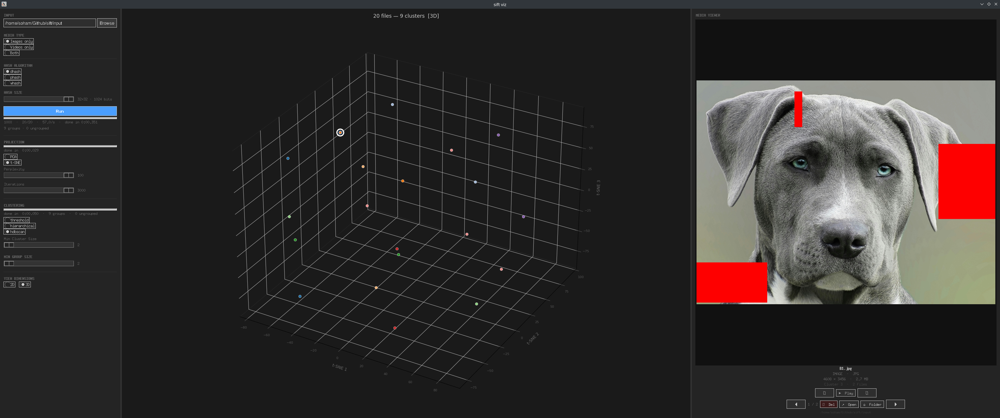

# SIFT

> *An homage to SIFT (Scale-Invariant Feature Transform) — a landmark algorithm in computer vision.*

SIFT is a tool for finding visual similarity across a collection of images and videos. Point it at a folder, and it figures out which files look alike, groups them together, and lets you explore those groups interactively in a visual interface.

It's built in the spirit of FFmpeg — a focused, fast, command-line tool that does one thing well and composes cleanly with other tools.

---

## What it does

Given a folder of images and/or videos, SIFT:

1. **Compresses each file's visual identity into a tiny fingerprint** (called a perceptual hash) — a sequence of bits that captures what the file *looks like*, not its exact pixel values
2. **Measures how visually similar every pair of files is** to each other using the difference between their fingerprints
3. **Groups files that look similar** into clusters using your choice of algorithm
4. **Projects the entire collection onto a 2D or 3D map** so you can see the structure of your media library at a glance
5. **Lets you explore the map interactively** — click any point to preview that file, browse groups, and play videos inline

The key insight: two files that look similar have fingerprints that are numerically close. This turns "visual similarity" into a math problem that computers can solve quickly.

---

## How the fingerprinting works

A perceptual hash is not like a password hash (where any tiny change produces a completely different output). Instead it's designed so that *similar inputs produce similar outputs*. Resize an image, re-compress it, adjust the brightness — the hash barely changes. Put a completely different image in — the hash is very different.

SIFT supports three fingerprinting algorithms, each sensitive to different visual properties:

| Algorithm | What it captures | Best for |
|---|---|---|
| **dHash** | Edge structure and gradients — where brightness changes across the image | Structural duplicates, same composition different colour |
| **pHash** | Low-frequency patterns via DCT (the same math JPEG uses internally) | Near-duplicates across compression, scaling, minor edits |
| **wHash** | Multi-scale texture and structure via wavelet transform | Distinguishing images with similar layout but different textures |

For videos, SIFT extracts N evenly-spaced frames, hashes each one, then combines them into a single fingerprint via majority vote (each bit is set if more than half the frames agree on it).

---

## How the clustering works

Once every file has a fingerprint, SIFT computes the similarity between every pair. Three clustering algorithms are available:

- **Threshold** — group any two files whose fingerprints differ by less than N bits. Simple and fast, good starting point
- **Hierarchical** — builds a tree of merges from most-similar pairs outward, then cuts the tree at a chosen height. Good for understanding the nested structure of your collection
- **HDBSCAN** — a density-based algorithm that finds clusters of arbitrary shape without requiring you to specify how many there are. Best overall quality, handles noise well

---

## How the visualization works

Fingerprints are high-dimensional (64–1024 bits). To draw them on a screen, SIFT projects them down to 2D or 3D using:

- **PCA** — fast, preserves global structure. Points that are far apart in the plot are genuinely dissimilar. Can look like a line or star when most files are very similar (this is correct — it means your collection has one dominant axis of variation)
- **t-SNE** — slower, preserves local structure. Clusters pull apart cleanly even when PCA shows everything on one axis. Distances *between* clusters are not meaningful, but cluster membership is

Both are computed upfront when you click Run — switching between 2D and 3D is instant.

---

## Requirements

**To build the CLI:**
- C++17 compiler (GCC or Clang)
- CMake 3.20+
- Ninja (optional but faster)

**To run the visualizer:**
- Python 3.13+
- [uv](https://github.com/astral-sh/uv) (Python package manager)
- ffmpeg + ffprobe (for video support and inline playback)

---

## Building

```bash
# First time only — configure the build
make configure

# Build the sift binary
make build
```

The binary is written to `build/sift`.

---

## Running

### Hash a folder of images

```bash
make run ARGS="hash ./my-photos --algo=phash --output=hashes.json"
```

Options:
- `--algo=dhash|phash|whash` — fingerprinting algorithm (default: dhash)
- `--size=N` — hash grid size N×N, so N²  bits (default: 8, range: 2–32)
- `--media=images|videos|all` — what to include (default: images)
- `--frames=N` — frames to sample per video (default: 8)
- `--threads=N` — parallel workers (default: all CPU cores)
- `--output=file` — write JSON to file instead of stdout

### Cluster the hashes

```bash
make run ARGS="cluster hashes.json --method=hdbscan --output=clusters.json"
```

Options:
- `--method=threshold|hierarchical|hdbscan` (default: threshold)
- `--threshold=N` — max bit difference to group (threshold method, default: 10)
- `--linkage=single|complete|average` — merge strategy (hierarchical, default: complete)
- `--cut-height=N` — where to cut the merge tree (hierarchical, default: 10)
- `--min-group=N` — minimum cluster size (hdbscan, default: 3)
- `--min-filter=N` — hide groups smaller than N in output (default: 2)

### Project to 2D/3D

```bash
make run ARGS="project hashes.json --method=pca --dims=3 --output=projection.json"
```

### Pipe commands together

```bash
./build/sift hash ./photos --algo=phash | ./build/sift cluster - --method=hdbscan
```

---

## Interactive visualizer

```bash
make viz
```



This opens the visual interface. From left to right:

**Left panel — controls**
- Choose your folder, hash algorithm, hash size, and whether to include images, videos, or both
- Choose the projection method (PCA or t-SNE) and clustering algorithm
- Click **Run** to start — hashing is the slow step, everything else is near-instant
- Adjust clustering sliders live without re-running
- Toggle between 2D and 3D view at the bottom (no re-run needed)

**Centre panel — the map**
- Each dot is a file. Colour indicates cluster membership — same colour means the algorithm grouped them together
- Grey dots are ungrouped (no close neighbours found)
- Click any dot to select it and preview it in the right panel
- In 3D mode: drag to rotate, scroll to zoom

**Right panel — media viewer**
- Shows a thumbnail (or video frame) of the selected file
- If the file belongs to a group, use ◀ ▶ to browse all members
- **Play** — plays video files inline in the panel (requires ffmpeg)
- **Open** — opens the file in your system's default application
- **Folder** — reveals the file in your file manager
- **Del** — moves the file to the system trash and removes it from the map

---

## Project structure

```
sift/
├── CMakeLists.txt
├── Makefile                  # convenience wrapper
├── src/
│   ├── main.cpp              # CLI: subcommands hash / cluster / project
│   ├── hash/
│   │   ├── hash.hpp          # HashResult type + dHash / pHash / wHash
│   │   ├── dHash.cpp
│   │   ├── pHash.cpp
│   │   ├── wHash.cpp
│   │   ├── image.cpp         # image loading via stb_image
│   │   ├── video_hash.hpp    # hash_video() — majority-vote across frames
│   │   └── video_hash.cpp
│   ├── cluster/
│   │   ├── cluster.hpp       # GroupInfo, DistanceMatrix types
│   │   ├── distance.cpp      # pairwise Hamming distance matrix
│   │   ├── thresh.cpp        # threshold clustering
│   │   ├── hierarchical.cpp  # agglomerative clustering
│   │   └── hdbscan.cpp       # HDBSCAN
│   ├── io/
│   │   ├── io.hpp            # scan_images / scan_videos / scan_media
│   │   ├── scanner.cpp
│   │   ├── frame_source.hpp  # FrameSource abstraction for video frames
│   │   ├── frame_source.cpp  # EvenlySpacedSource implementation
│   │   ├── json_parse.cpp    # parse hash JSON back to ClusterInput
│   │   └── writer.cpp
│   ├── project/
│   │   ├── project.hpp       # ProjectionResult type
│   │   ├── pca.cpp           # PCA projection
│   │   └── tsne.cpp          # t-SNE projection
│   └── core/
│       └── threadpool.hpp    # work-stealing thread pool
├── third_party/
│   └── stb_image.h           # single-header image decoder
└── viz/
    ├── visualize.py          # entry point shim
    ├── pyproject.toml        # uv-managed dependencies
    └── sift_viz/
        ├── app.py            # SiftViz — main tk.Tk application
        ├── pipeline.py       # PipelineRunner — hash/project/cluster subprocess threads
        ├── scatter.py        # ScatterController — matplotlib axes, hit-testing, selection ring
        ├── player.py         # VideoPlayer — ffmpeg decode + ffplay audio
        ├── cache.py          # CacheManager — persist results to ~/.cache/sift/
        ├── models.py         # Pydantic models — HashSettings, ProjectionResult, ClusterResult, …
        ├── media.py          # media loading, ffprobe helpers, formatting utilities
        ├── widgets.py        # widget factory functions
        └── constants.py      # colours, file extensions, capability flags
```

---

## Design philosophy

- **CLI does everything** — every operation is scriptable, the visualizer is optional
- **Composable** — hash output is plain JSON, pipe it to other tools or load it elsewhere
- **Fast** — hashing is parallel across all CPU cores; clustering and projection are near-instant for typical library sizes
- **Minimal dependencies** — image decoding via a single-header library; no external math frameworks; ffmpeg used as a subprocess rather than a linked library
